# Modelos del Sistema de Asignación de Cursos

## 📅 Fecha
<div align="center">  </div>

## Modelo Semántico

### Entidades y Propiedades

1. **MiembroCLUB**:
   - **Atributos**: 
     - `NOMBRE`: Nombre del miembro.
     - `EDAD`: Edad del miembro.
     - `INVITADO_POR`: Quién lo invitó al club.

2. **Cursos**:
   - **Atributos**:
     - `ID_CURSO`: Identificador único del curso.
     - `NOMBRE_CURSO`: Nombre del curso (ej. SQL, Python, Power BI).

3. **Profesores**:
   - **Atributos**:
     - `ID_PROFESOR`: Identificador único del profesor.
     - `NOMBRE_PROFESOR`: Nombre del profesor.

4. **Aulas**:
   - **Atributos**:
     - `ID_AULA`: Identificador único del aula.
     - `LETRA_AULA`: Letra que identifica el aula.

5. **Horario**:
   - **Atributos**:
     - `ID_HORARIO`: Identificador único del horario.
     - `DÍA`: Día de la semana.
     - `HORA`: Hora de la clase.

6. **AsignaciónCursoProfesorAulaHorario** (Entidad Relacional):
   - **Atributos**:
     - `ID_ACP`: Identificador único de la asignación.
     - `ID_CURSO`: Relación con la entidad Cursos.
     - `ID_PROFESOR`: Relación con la entidad Profesores.
     - `ID_AULA`: Relación con la entidad Aulas.
     - `ID_HORARIO`: Relación con la entidad Horarios.

## Modelo Lógico

### Tablas y Relaciones

1. **MiembroCLUB**
```sql
CREATE TABLE MiembroCLUB (
    NOMBRE NVARCHAR(50),
    EDAD INT,
    INVITADO_POR NVARCHAR(50)
);
```

2. **Cursos**
```sql
CREATE TABLE Cursos (
    ID_CURSO INT PRIMARY KEY,
    NOMBRE_CURSO NVARCHAR(50)
);
```

3. **Profesores**
```sql
CREATE TABLE Profesores (
    ID_PROFESOR INT PRIMARY KEY,
    NOMBRE_PROFESOR NVARCHAR(50)
);
```

4. **Aulas**
```sql
CREATE TABLE Aulas (
    ID_AULA INT PRIMARY KEY,
    LETRA_AULA CHAR(1)
);
```

5. **Horario**
```sql
CREATE TABLE Horario (
    ID_HORARIO INT PRIMARY KEY,
    DIA NVARCHAR(20),
    HORA INT
);
```

6. **AsignaciónCursoProfesorAulaHorario**
```sql
CREATE TABLE AsignaciónCursoProfesorAulaHorario (
    ID_ACP INT PRIMARY KEY,
    ID_CURSO INT,
    ID_PROFESOR INT,
    ID_AULA INT,
    ID_HORARIO INT,
    FOREIGN KEY (ID_CURSO) REFERENCES Cursos(ID_CURSO),
    FOREIGN KEY (ID_PROFESOR) REFERENCES Profesores(ID_PROFESOR),
    FOREIGN KEY (ID_AULA) REFERENCES Aulas(ID_AULA),
    FOREIGN KEY (ID_HORARIO) REFERENCES Horario(ID_HORARIO)
);
```

## Diagrama ER en Mermaid

```mermaid
erDiagram
    MiembroCLUB {
        NVARCHAR NOMBRE
        INT EDAD
        NVARCHAR INVITADO_POR
    }

    Cursos {
        INT ID_CURSO PK
        NVARCHAR NOMBRE_CURSO
    }

    Profesores {
        INT ID_PROFESOR PK
        NVARCHAR NOMBRE_PROFESOR
    }

    Aulas {
        INT ID_AULA PK
        CHAR LETRA_AULA
    }

    Horario {
        INT ID_HORARIO PK
        NVARCHAR DIA
        INT HORA
    }

    AsignacionCursoProfesorAulaHorario {
        INT ID_ACP PK
        INT ID_CURSO FK
        INT ID_PROFESOR FK
        INT ID_AULA FK
        INT ID_HORARIO FK
    }

    MiembroCLUB }o..o{ Cursos : "inscrito_en"
    Cursos ||--o{ AsignacionCursoProfesorAulaHorario : "asignado_a"
    Profesores ||--o{ AsignacionCursoProfesorAulaHorario : "enseña"
    Aulas ||--o{ AsignacionCursoProfesorAulaHorario : "se_dicta_en"
    Horario ||--o{ AsignacionCursoProfesorAulaHorario : "dictado_en"

```
