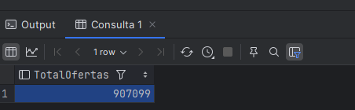
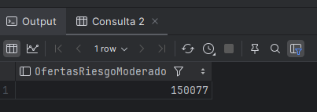
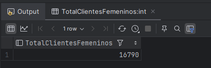
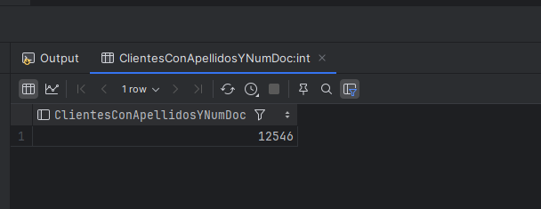
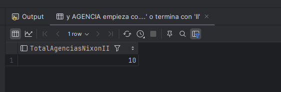
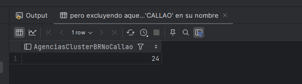
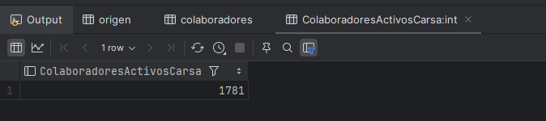
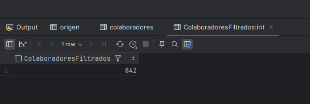
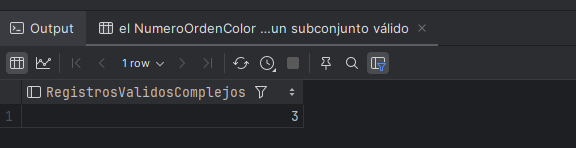
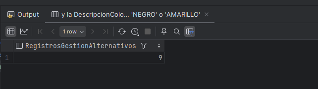

# Actividad: Exploración de Tablas y Consultas en SQL

## Instrucciones

1. **Explorar las 6 tablas**:
   - `ofertas`
   - `clientes`
   - `agencias`
   - `colaboradores`
   - `gestion`
   - `gestion_detalle`

2. **Realizar 2 consultas por tabla**:
   - Cada consulta debe incluir un alias para la tabla.
   - Debe contener al menos dos condiciones combinadas con operadores lógicos (`AND`, `OR`).
   - Mostrar el conteo de resultados con `COUNT(*)`.

3. **Entregar resultados**:
   - Consultas SQL completas.
   - Contar el total de registros que cumplen las condiciones especificadas.

## Consultas SQL

## **Tabla `ofertas`**
```sql
-- Consulta 1
SELECT COUNT(*) AS TotalOfertas
FROM ofertas o
WHERE TRY_CAST(o.Tasa AS FLOAT) > 15 
  AND (o.PeriodoVigencia = '202109' OR o.PeriodoVigencia = '202110');
```


- **Descripción**: Cuenta las ofertas con una `Tasa` mayor a 15 y `PeriodoVigencia` en '202109' o '202110'.  
- **Objetivo**: Identificar ofertas de alta tasa de interés en períodos específicos.

```sql
-- Consulta 2
SELECT COUNT(*) AS OfertasRiesgoModerado
FROM ofertas o
WHERE TRY_CAST(o.NivelRiesgo AS FLOAT) BETWEEN 0.2 AND 0.5
  AND TRY_CAST(o.Linea AS FLOAT) > 10000;
```


- **Descripción**: Filtra ofertas con `NivelRiesgo` entre 0.2 y 0.5 y `Linea` mayor a 10,000.  
- **Objetivo**: Detectar ofertas con nivel de riesgo moderado y líneas de crédito altas.

## **Tabla `clientes`**
```sql
-- Consulta 1
SELECT COUNT(*) AS TotalClientesFemeninos
FROM clientes c
WHERE c.sexo = 'F'
  AND c.numdoc IS NOT NULL
  AND c.telefono IS NOT NULL;
```


- **Descripción**: Cuenta clientes de sexo femenino con `numdoc` y `telefono` no nulos.  
- **Objetivo**: Validar clientes femeninos con información completa.

```sql
-- Consulta 2
SELECT COUNT(*) AS ClientesConApellidosYNumDoc
FROM clientes c
WHERE c.apellidoPaterno IS NOT NULL 
  AND (c.numdoc LIKE '0%' OR c.numdoc LIKE '%7');
```


- **Descripción**: Identifica clientes con `apellidoPaterno` no nulo y documentos que empiezan con '0' o terminan en '7'.  
- **Objetivo**: Filtrar clientes con características específicas en sus documentos.

## **Tabla `agencias`**
```sql
-- Consulta 1
SELECT COUNT(*) AS TotalAgenciasNixonII
FROM agencias a
WHERE a.ZONAL_NOMBRE IS NOT NULL
  AND a.CLUSTER LIKE '%NIXON%'
  AND (a.AGENCIA LIKE 'AG.%' OR a.AGENCIA LIKE '%II');
```


- **Descripción**: Filtra agencias donde `CLUSTER` contiene 'NIXON' y `AGENCIA` comienza con 'AG.' o termina en 'II'.  
- **Objetivo**: Identificar agencias específicas con filtros avanzados.

```sql
-- Consulta 2
SELECT COUNT(*) AS AgenciasClusterBRNoCallao
FROM agencias a
WHERE (a.ZONAL_NOMBRE IS NULL OR a.CLUSTER LIKE 'BR%')
  AND a.AGENCIA NOT LIKE '%CALLAO%';
```


- **Descripción**: Filtra agencias donde el `CLUSTER` comienza con 'BR' o `ZONAL_NOMBRE` es nulo, excluyendo agencias con 'CALLAO'.  
- **Objetivo**: Excluir agencias de CALLAO y validar zonas incompletas.

## **Tabla `colaboradores`**
```sql
-- Consulta 1
SELECT COUNT(*) AS ColaboradoresActivosCarsa
FROM colaboradores c
WHERE (c.ESTADO = 'A' OR c.ESTADO = 'LICENCIA POST NATAL')
  AND (c.AGENCIA LIKE '%CARSA%' OR c.AGENCIA LIKE 'AG.%')
  AND c.NOMBRE NOT LIKE '%STAFF%'
  AND c.NOMBRE IS NOT NULL;
```


- **Descripción**: Filtra colaboradores activos o en licencia, con `AGENCIA` que contiene 'CARSA' o empieza con 'AG.', excluyendo STAFF.  
- **Objetivo**: Identificar colaboradores activos en agencias específicas.

```sql
-- Consulta 2
SELECT COUNT(*) AS ColaboradoresFiltrados
FROM colaboradores c
WHERE (c.NACIONALIDAD = 'peruano' OR c.NACIONALIDAD = 'extranjero')
  AND (c.AGENCIA IS NULL OR c.AGENCIA LIKE 'AG.%')
  AND c.ESTADO IS NOT NULL AND c.ESTADO != 'RENUNCIO'
  AND TRY_CAST(c.CODIGO_TRABAJADOR AS INT) > 10000
  AND TRY_CAST(c.CODIGO_TRABAJADOR AS INT) < 20000;
```


- **Descripción**: Cuenta colaboradores peruanos o extranjeros, con `CODIGO_TRABAJADOR` entre 10,000 y 20,000, y sin estado 'RENUNCIO'.  
- **Objetivo**: Filtrar colaboradores activos con condiciones avanzadas.

## **Tabla `gestion_detalle`**
```sql
-- Consulta 1
SELECT COUNT(*) AS RegistrosValidosComplejos
FROM gestion_detalle gd
WHERE (gd.ResultadoTelefonoCRM IN ('Contacto Válido', 'Cliente no Contestable'))
  AND TRY_CAST(gd.CodigoResultadoCRM AS INT) > 2
  AND gd.NumeroOrdenColor < 5
  AND gd.GrupoEstadoGestion IN (
      SELECT DISTINCT GrupoEstadoGestion
      FROM gestion_detalle
      WHERE GrupoEstadoGestion IS NOT NULL AND GrupoEstadoGestion > 2
  )
  AND gd.DescripcionColor NOT LIKE '%ROJO%';
```


- **Descripción**: Filtra registros válidos con `ResultadoTelefonoCRM` en valores específicos, excluyendo colores 'ROJO' y validando subconjuntos.  
- **Objetivo**: Identificar registros válidos según estados y resultados.

```sql
-- Consulta 2
SELECT COUNT(*) AS RegistrosGestionAlternativos
FROM gestion_detalle gd
WHERE gd.GrupoEstadoGestion > 2
  AND gd.NumeroOrdenColor % 2 = 1
  AND TRY_CAST(gd.CodigoResultadoCRM AS INT) BETWEEN 1 AND 6
  AND gd.DescripcionColor IN ('NEGRO', 'AMARILLO')
  AND gd.ResultadoTelefonoCRM NOT IN ('Teléfono no existe', 'Teléfono Equivocado');
```


- **Descripción**: Filtra registros con `GrupoEstadoGestion` mayor a 2, números de orden impares y colores específicos.  
- **Objetivo**: Validar registros alternativos según criterios avanzados.


## Consideraciones
- Se utilizó un alias para cada tabla: `o`, `c`, `a`, `g`, `gd`.
- Las consultas incluyen múltiples condiciones combinadas con operadores lógicos (`AND`, `OR`) para mayor complejidad y flexibilidad.
- Los conteos permiten evaluar la cantidad de registros que cumplen las condiciones definidas.

## Link:
- Puedes acceder a la tarea en el classroom en el siguiente [enlace](https://classroom.google.com/c/NzM5NDcxNTYyMTMw/a/NzQxMjA1OTY0MzM3/details).

## ✍️ Autor
<div style="background-image: url('../../imgs/background.jpg'); background-size: cover; padding: 20px; text-align: center; border-radius: 10px;">
    <a href="https://github.com/ElJoamy" style="text-decoration: none; color: black; display: inline-block; text-align: center;">
        
        <h1 style="margin: 10px 0 0; font-size: 1.5em; color: black; font-weight: bold;">Joseph Anthony Meneses Salguero</h1>
    </a>
    <br />
    <a href="https://linkedin.com/in/joamy5902" title="LinkedIn"></a>
    <a href="mailto:joamysalguero1@gmail.com" title="Email"></a>
    <a href="https://medium.com/@joamysalguero1" title="Medium"></a>
</div>
